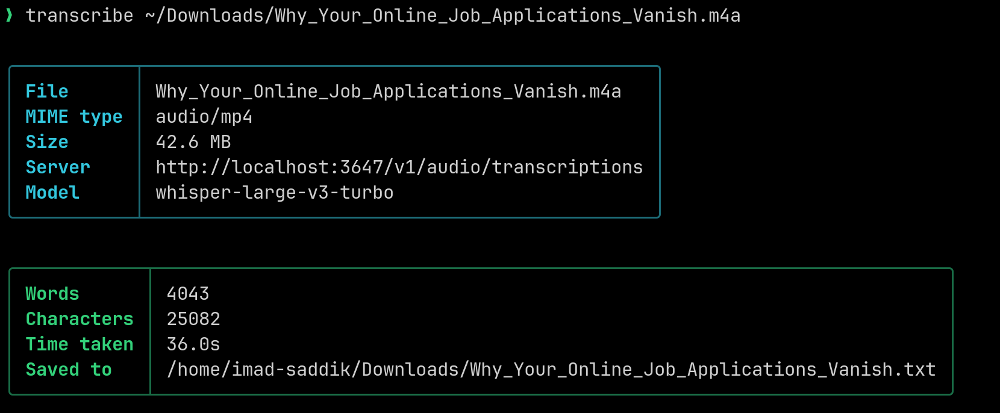

# Transcribe CLI

[](https://github.com/ImadSaddik/TranscribeCLI/blob/main/LICENSE)
[](https://www.python.org/)



Transcribe CLI is a fast, lightweight, and user-friendly command-line utility for transcribing audio files using a local server running [whisper.cpp](https://github.com/ggml-org/whisper.cpp).

## Installation

You can install the CLI tool system-wide using the provided [Makefile](./Makefile).

Navigate to the project directory and run:

```bash
make install
```

This command installs a lightweight wrapper script in `/usr/local/bin/transcribe` which automatically runs the main script with the correct dependencies using `uv`.

To uninstall the script, run:

```bash
make uninstall
```

## Usage

Run the `transcribe` command followed by the path to your audio file:

```bash
transcribe podcast.mp3
```

By default, the transcription will be saved in the same directory as the audio file with a `.txt` extension.

If you want to specify a custom output file path, pass it as a second argument:

```bash
transcribe podcast.mp3 /path/to/custom_output.txt
```

To view the help information:

```bash
transcribe --help
```

## License

This project is licensed under the MIT License. See the [LICENSE](./LICENSE) file for details.
